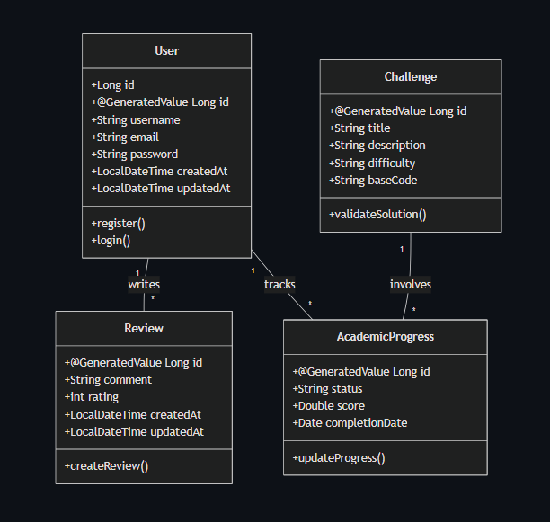

# 🌋 cursos-vulcano-grupo-1
**Plataforma de gamificación educativa para fortalecer la lógica de programación mediante desafíos interactivos.**

---

## 📌 Introducción / Contexto

- **Descripción del problema:** Los estudiantes de desarrollo de software enfrentan dificultades para consolidar conocimientos teóricos de forma motivadora, existiendo una brecha significativa entre la teoría impartida y su aplicación práctica creativa.
- **Justificación:** VULCANO API surge para promover la interacción y motivación mediante dinámicas lúdicas que reducen esa brecha, integrando el aprendizaje con experiencias gamificadas.
- **Contexto:** Proyecto académico desarrollado para la Carrera Técnica en Desarrollo de Software.

---

## 🎯 Objetivos

**Objetivo General:** Desarrollar e implementar una plataforma web de gamificación académica que fortalezca el aprendizaje de contenidos teóricos mediante una arquitectura cliente–servidor, utilizando React y Java Spring Boot.

**Objetivos Específicos:**

- **OE1:** Diseñar actividades lúdicas grupales e individuales integradas en una interfaz web dinámica y responsiva.
- **OE2:** Aplicar metodologías ágiles durante el desarrollo para garantizar la adaptación continua a los requerimientos.
- **OE3:** Evaluar y ajustar continuamente el funcionamiento de la plataforma mediante pruebas funcionales y retroalimentación de usuarios.
- **OE4:** Implementar funcionalidades interactivas para gestión de reseñas, desafíos académicos y ejecución de código en tiempo real con una API REST.

---

## 📐 Alcance del Proyecto (Scope)

**Qué se va a desarrollar:**

- Plataforma web interactiva construida con React, JavaScript y Tailwind CSS.
- Arquitectura cliente–servidor con API REST desarrollada en Java Spring Boot y Spring Data JPA.
- Gestión de datos con Spring Data JPA / Hibernate para modelado de usuarios, reseñas y desafíos.
- Sistema CRUD académico completo para contenidos y retos.
- Módulo de desafíos interactivos con editor de código en el navegador.
- Sistema de autenticación y validación de usuarios.

**Qué NO se va a desarrollar (Fuera de alcance):**

- Entorno de ejecución de código en servidor con sandbox seguro.
- Evaluación automática con inteligencia artificial.
- Aplicación móvil nativa.
- Despliegue en infraestructura de alta disponibilidad.

---

## 🛠️ Tecnologías y Herramientas (Tech Stack)

- **Backend:** Java 21, Spring Boot 3.4.2, Spring Data JPA, Maven.
- **Frontend:** React, JavaScript (ES6+), Tailwind CSS.
- **Base de Datos:** PostgreSQL para producción y H2 para desarrollo local.
- **Otras herramientas:** Git, GitHub, Postman, VScode.

**Dependencias obligatorias del proyecto (Backend):**

| Dependencia | Versión | Descripción |
| :--- | :--- | :--- |
| `spring-boot-starter-web` | 3.4.2 | API REST con Spring MVC |
| `spring-boot-starter-data-jpa` | 3.4.2 | ORM con Hibernate / Spring Data JPA |
| `lombok` | managed | Reducción de boilerplate (getters, setters, constructores) |
| `spring-boot-devtools` | 3.4.2 | Recarga automática en desarrollo |
| `h2` | runtime | Base de datos en memoria para pruebas locales |
| `postgresql` | runtime | Driver JDBC para PostgreSQL en producción |

> ⚠️ **Nota importante:** Este proyecto utiliza **Spring Data JPA** como ORM. Prisma es un ORM exclusivo del ecosistema Node.js y **no es compatible** con Spring Boot/Hibernate. Toda la gestión de datos se realiza a través de Spring Data JPA.

---

## 👥 Integrantes del Equipo

| Nombre | Rol principal | Usuario GitHub |
| :--- | :--- | :--- |
| Mario Múnera | Líder / Backend | [@MarioMunera1993](https://github.com/MarioMunera1993) |
| Albany Luciani | Frontend Lead | [@albanyluciani1](https://github.com/albanyluciani1) |
| Roque Aldana | Backend / DB Specialist | [@Julio28012020](https://github.com/Julio28012020) |
| Julio Correa | QA / Tester | [@Jcorrea24](https://github.com/Jcorrea24) |
| Sergio Montoya | UI/UX Designer | [@SerelbochaD3773](https://github.com/SerelbochaD3773) |

---

## 📊 Diagrama de Clases del Dominio (v1)



*Diagrama que contempla las entidades: Usuario, Reseña, Desafío y Progreso Académico. Los IDs utilizan `@GeneratedValue` y las entidades clave incluyen atributos de auditoría `createdAt`/`updatedAt`.*

---

## 🚀 Instrucciones de Instalación y Ejecución

### 1. Clonar el repositorio

```bash
git clone https://github.com/MarioMunera1993/vulcano-api-grupo-1.git
```

### 2. Entrar al directorio

```bash
cd vulcano-api-grupo-1
```

### 3. Configurar perfiles de Spring Boot

El proyecto utiliza perfiles de Spring Boot para alternar entre entornos. Los archivos de configuración están en `src/main/resources/`.

**Perfil de Desarrollo — `application-dev.properties` (H2 en memoria):**

```properties
# Perfil: dev
spring.datasource.url=jdbc:h2:mem:vulcanodb
spring.datasource.driver-class-name=org.h2.Driver
spring.datasource.username=sa
spring.datasource.password=
spring.jpa.database-platform=org.hibernate.dialect.H2Dialect
spring.jpa.hibernate.ddl-auto=create-drop
spring.h2.console.enabled=true
spring.h2.console.path=/h2-console
```

Activa este perfil con:
```bash
./mvnw spring-boot:run -Dspring-boot.run.profiles=dev
```

**Perfil de Producción — `application-prod.properties` (PostgreSQL):**

> 🔒 **Importante:** Las credenciales **nunca** deben estar hardcodeadas. Usa variables de entorno y añade este archivo a `.gitignore` si contiene valores reales.

```properties
# Perfil: prod
spring.datasource.url=jdbc:postgresql://<host>:<puerto>/<nombre_bd>?sslmode=require
spring.datasource.driver-class-name=org.postgresql.Driver
spring.datasource.username=${DB_USERNAME}
spring.datasource.password=${DB_PASSWORD}
spring.jpa.database-platform=org.hibernate.dialect.PostgreSQLDialect
spring.jpa.hibernate.ddl-auto=update
```

Activa este perfil con:
```bash
./mvnw spring-boot:run -Dspring-boot.run.profiles=prod
```

### 4. Ejecutar la aplicación

Desde la terminal:

```bash
./mvnw spring-boot:run
```

O desde su IDE ejecutando: **Run → VulcanoApiApplication**.

---

## 📄 Licencia

MIT License *(Recomendada para proyectos académicos).*